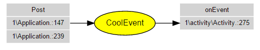

EventBusGraph
=============

If you use [EventBus](https://github.com/greenrobot/EventBus) from greenrobot, you will find EventBusGraph very helpful.<br/>
EventBusGraph Scans java files, looking for post() and onEvent() methods and generates an HTML file that shows the relationships between events, posts and onEvents.




Dependencies
------------

To view the graphs, it is necessary to add the [viz.js](https://github.com/mdaines/viz.js/) library in the same folder where the HTML file is. You can download it from:

[viz.js download](https://github.com/mdaines/viz.js/releases)

EventBusGraph in 3 steps
------------------------

1. Create a config_file with the base paths of the files to scan and the output folder:<br/>
`path/to/base/one`<br/>
`path/to/another_base/two`<br/>
`... more paths ...`<br/>
`path/to/the_last_base`<br/>
`path_out = path/to/output_folder`<br/>

2. Run the command:<br/>
`python eventbus_graph.py config_file`

3. Open the generated HTML file in your favorite browser.

Conventions
-----------
* Use: `EventBus.getDefault()` or `mEventBus`, example:<br/>
```Java
EventBus.getDefault().post(new String("Hello"));
EventBus mEventBus = EventBus.getDefault();
mEventBus.post(new String("Hello"));
```

* Use cast to the same class if you create your objects outside the post, example:<br/>
```java
String event = "message";
EventBus.getDefault().post((String)event);
```

Limitations
-----------
* Doesn't recognize comments (at least for now). You shouldn't comment post or onEvents methods. They will be showed any way.
* Unable to analyze if the methods are called between the register() and unregister() methods. 
